# THE COWARD KING

## Game Design Document — Updated Version

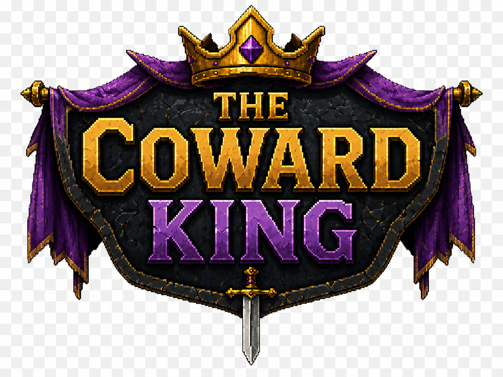

**Tactical Roguelite Board Game**

| Game Title | The Coward King |
| :---- | :---- |
| **Genre** | Roguelite Tactical Turn-Based Board Game |
| **Platform** | PC (Desktop / Web Browser) |
| **Target Audience** | Strategy & roguelite fans, ages 12+ |
| **Team Size/Name** | 3 developers — Silent Crown |
| **Document Status** | Final version updated according to the implemented program |
| **Authors** | José Abel Domínguez Rish A01781852 · Leonardo André Flores Mendoza A01787221 · Nicolás Casillas Larrañaga A01787292 |

---

> **Note about this document:** This GDD reflects the actual state of the implemented game. Differences from the original GDD are marked with `[CHANGE]`. Sections that remained the same are preserved in full.

---

# 1. Index

1. Index
2. Game Design
   - 2.0 Story
   - 2.1 Overview
   - 2.2 Gameplay
   - 2.3 Mindset
   - 2.4 Roguelite and TCG Elements
   - 2.5 Visual Style
   - 2.6 References
3. Technical
   - 3.1 Screens
   - 3.2 Controls
   - 3.3 Mechanics
4. Level Design
   - 4.1 Themes
   - 4.2 Game Flow
5. Development
   - 5.1 Abstract Classes
   - 5.2 Derived Classes
6. Graphics
7. Sounds / Music
8. Backend and Database
9. Development Schedule

---

# 2. Game Design

## 2.0 Story

The Kingdom of Velundra has known many kings. Brave kings. Fierce kings. Kings who charged headfirst into battle, sword raised high, and died before their crowns even had time to lose their shine.

Then came King Aldric the Prudent, and everything changed.

Aldric was not born a warrior. He was born a strategist. While other kings trained their bodies, Aldric trained his mind, his tongue, and his network of loyal subjects. When the Skeleton Horde rose from the Catacombs beneath the kingdom, every advisor expected him to march. Instead, Aldric retreated to the center of his war room, summoned his cards, and began to think.

His enemies called it cowardice. His people called it genius.

Now Aldric must do what he does best: survive. Not by fighting, not by fleeing, but by being the smartest person on the board.

The coward king does not run because he is afraid. He runs because he is already three moves ahead.

---

## 2.1 Overview

### Basic Game Description

The Coward King is a highly tactical roguelite game played on an 8×8 board, similar in size to a chessboard. The game revolves around a king who is both the most powerful and the most vulnerable piece on the board: he cannot defend himself directly, so he uses a hand of cards to deploy allies and political traps that protect him.

The objective of the game is for the King to survive the required number of turns in each horde without allowing the **pressure** inside his 3×3 safe zone to reach or exceed 2. A normal enemy counts as 1 pressure; a boss counts as 2.

The game has three levels, each with several hordes and a final boss, for a total of 12 encounters. As in any good roguelite, if the King falls, the run returns to Level 1 Horde 1, but permanent upgrades purchased with earned gold are kept.

`[CHANGE]` **Revised defeat condition:** The original GDD stated that the King would lose if an enemy “touched” him. In the final implementation, defeat occurs when the accumulated enemy pressure inside the 3×3 safe zone reaches 2 or more, regardless of whether the King was directly touched. Bosses count as 2 pressure by themselves.

### Design Model: Roguelite

- **Permanent upgrades:** Card upgrades (+damage, +HP, −AP cost) purchased with gold survive death. Each attempt is stronger than the previous one.
- **`[CHANGE]` Checkpoint system:** Death always returns the player to Level 1 Horde 1, not to the beginning of the current level as originally planned.
- **Random hand:** Random cards are dealt from a pool at the start of each horde, generating variation between attempts.
- **Short sessions:** Each horde has a variable turn limit, detailed later. A full game takes 1–3 hours.
- **“One more run” loop:** The combination of random hands, permanent upgrades, and the Desperation meter creates the genre’s compulsive loop.

---

## 2.2 Gameplay

### Objective

**Victory by horde:** Survive the required turns without the pressure in the King’s safe zone reaching 2 or more.

**Defeat:** The pressure in the safe zone reaches 2 or more, OR the King’s Desperation reaches 4.

**Total victory:** Complete all 3 levels (3 hordes + 1 boss each) = 12 encounters cleared.

### Level Structure

| Level | Encounters | Turn limit per horde |
| :---- | :---- | :---- |
| **Level 1** | Horde 1 / Horde 2 / Horde 3 / Boss: Skeleton King | 10 / 15 / 20 / no limit |
| **Level 2** | Horde 1 / Horde 2 / Horde 3 / Boss: Ogre Boss | 20 / 26 / 32 / no limit |
| **Level 3** | Horde 1 / Horde 2 / Horde 3 / Boss: Brave King | 20 / 28 / 34 / no limit |

`[CHANGE]` **Turn limit:** The original GDD established a fixed 30-turn limit for all hordes. The final implementation uses variable and progressive limits based on the horde and level, shown above. Boss encounters do not have a turn limit; they must be won by defeating the boss.

`[CHANGE]` **Checkpoint on death:** The original GDD specified that death in Level 2 would return the player to the beginning of Level 2. In the final implementation, every defeat returns the player to Level 1 Horde 1.

| **On death** | Unspent gold and current run progress are lost. Purchased upgrades are kept. |
| :---- | :---- |
| **On completing a level** | Automatic progression to the next level (no automatic saving implemented). |
| **Manual save** | The pause menu stores a partial local snapshot and sends available statistics. Full Resume Game restoration is not implemented yet. |

### The Board (8×8)

The board is organized as an 8-row × 8-column grid, for a total of 64 tiles. Tiles can contain:

- The King (exactly 1 at all times)
- One allied unit (Knight, Archer, Mage, etc.)
- One enemy unit
- A card effect (trap or zone)
- An immovable obstacle (debris)
- Empty space

The King starts on the center tile (row 4, column 4), and his 3×3 safe zone is dynamic and moves with him.

`[CHANGE]` **Immovable obstacles:** More advanced hordes generate random obstacles on the board (debris, broken furniture). These block movement and card placement. Boss encounters do not generate obstacles. The number of obstacles per horde is as follows:

| Level | Horde 1 | Horde 2 | Horde 3 |
| :---- | :---- | :---- | :---- |
| **1** | 0 | 2 | 4 |
| **2** | 2 | 4 | 6 |
| **3** | 2 | 3 | 4 |

`[CHANGE]` **Enemy spawn edges:** Enemies appear on board edges that expand as difficulty increases:

| Level | Horde 1 | Horde 2 | Horde 3 |
| :---- | :---- | :---- | :---- |
| **1** | Top only | Top, left, right | Top, left, right, bottom |
| **2** | Top, left | Top, left, right | Top, left, right, bottom |
| **3** | Top, left, right | Top, left, right, bottom | Top, left, right, bottom |

### Turn System

| Phase 1 — Player | Chooses ONE main action: play card(s) by spending AP OR move the King. Opening upgrades does NOT consume the turn. |
| :---- | :---- |
| **Phase 2 — Enemies** | Enemies move toward the King. Allied units automatically attack if an enemy is in range. |
| **Turn limit** | Variable by horde (see level table). Surviving the required turns = automatic victory for that horde. |
| **`[CHANGE]` Combat order** | In Horde 1 of Level 1, allies attack before enemies. Starting in Horde 2, and in all boss encounters, enemies act first, making positions more dangerous. |

### Player Actions (choose ONE per turn)

- **Play Card(s):** Spend AP to summon units or place effects. Multiple cards can be played in one turn if there is enough AP. Cards cannot be placed on occupied or obstructed tiles.
- **Move the King:** The King moves like the king in chess — 1 tile in any of the 8 directions. He cannot move onto tiles occupied by allies, enemies, or obstacles. The safe zone moves with him. Moving the King **resets Desperation** to 0.
- **Upgrade Cards (does not cost a turn):** Accessible from the upgrade menu during the player’s turn. Costs gold (20–50 per upgrade). Upgrades are permanent between deaths.

### Resource System

| Starting AP | 5 per horde |
| :---- | :---- |
| **`[CHANGE]` AP recovery** | If the King does NOT move during the turn, +1 AP is gained at the end of the turn. If the King moves, no AP is gained. |
| **`[CHANGE]` Maximum AP** | Limited to 5 at all times (not unlimited as originally stated). |
| **Card cost** | 1 to 4 AP depending on the card’s power. |
| **Gold per horde** | 10 gold for winning a normal horde. |
| **`[CHANGE]` Gold per boss** | 25 gold for defeating a boss (not mentioned in the original GDD). |
| **Gold on death** | Unspent gold is lost. Purchased upgrades are kept. |

### Card System — Hand Mechanic

- At the start of each horde: receive random cards from the pool (3 in the introductory first horde of Level 1; 4 in the rest).
- After winning a horde: choose 1 card from the previous hand to keep, then receive new random cards until the hand reaches 4.
- Maximum hand size: 4 cards.
- Cards are reusable during the current encounter. Playing a card spends AP and deselects it, but does not remove it from the hand.

`[CHANGE]` **Placement limits by upgrade:** Ally-type cards with high upgrade levels have a limit on how many copies can be on the board simultaneously. At upgrade level 3, only 3 copies can be in play. At level 2, the maximum is 5 copies. No upgrade means no limit.

---

### Complete Card Pool (15 Cards)

`[CHANGE]` **The original pool included “Royal Decree” (3×3 push). In the final implementation, this card was replaced by “Bomb” (massive 3×3 area damage).** The rest of the cards were preserved with minor cost adjustments.

| Card | Type | Cost (AP) | Stats | Effect |
| :---- | :---- | :---- | :---- | :---- |
| **Knight** | Allied Unit | 2 | 80 HP / 30 DMG | Melee. Attacks the nearest adjacent enemy. |
| **Archer** | Allied Unit | 3 | 50 HP / 20 DMG | Stationary. Attacks the nearest enemy within range 3. |
| **Mage** | Allied Unit | 4 | 40 HP / 25 DMG | Attacks the nearest enemy within range 2. Fragile but powerful. |
| **Pikeman** | Allied Unit | 2 | 60 HP / 15 DMG | Attacks the nearest enemy within range 1. |
| **Wall** | Defense Unit | 3 | 150 HP / 0 DMG | Blocks the tile. Enemies must destroy it or go around it. Has 3 visual frames based on remaining HP. |
| **Squire** | Defense Unit | 2 | 70 HP / 10 DMG | Reduces damage to adjacent allies by 50%. |
| **Tower** | Defense Unit | 4 | 100 HP / 35 DMG | Stationary. Attacks at range 4. |
| **Guardian** | Defense Unit | 3 | 120 HP / 25 DMG | Tank unit. Absorbs a lot of damage. |
| **Royal Guard** | Defense Unit | 2 | 90 HP / 0 DMG | Automatically follows the King every time he moves. |
| **Trench** | Defense Unit | 1 | 40 HP / 0 DMG | Cheap barricade that blocks a tile. |
| **Exile** | Trap | 2 | — | Trap: the enemy that steps on this tile is paralyzed for 2 turns. |
| **`[CHANGE]` Bomb** | Zone | 4 | 100 DMG | Detonates when placed. Deals 100 damage to all enemies in a 3×3 area. Replaces “Royal Decree.” |
| **Peace Treaty** | Zone | 3 | — | 3×3 zone. Freezes enemies inside the zone every turn for 4 turns. |
| **Royal Curse** | Zone | 4 | — | 3×3 zone. Enemies inside deal 50% less damage for 5 turns. |
| **Decoy** | Special Unit | 1 | 30 HP / 0 DMG | Enemies prioritize attacking the Decoy instead of the King. Cannot be upgraded. |

### Card Artwork Gallery

| | | | |
| :---: | :---: | :---: | :---: |
| 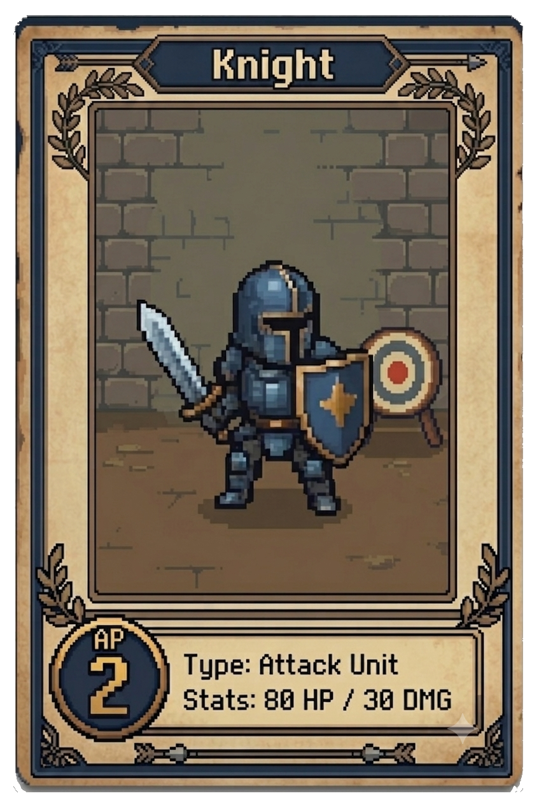 | 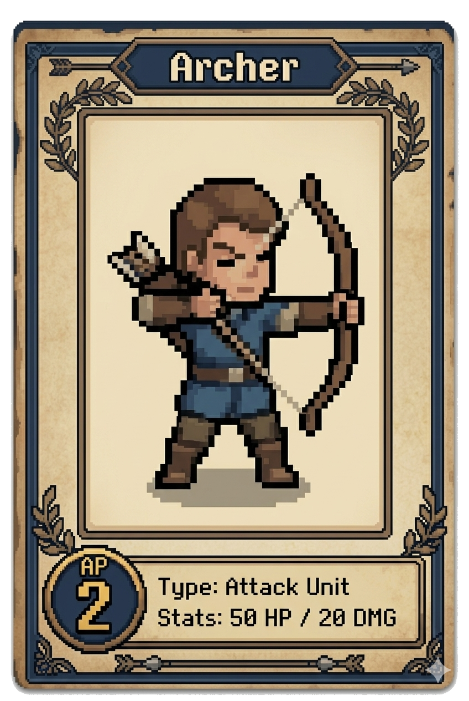 | 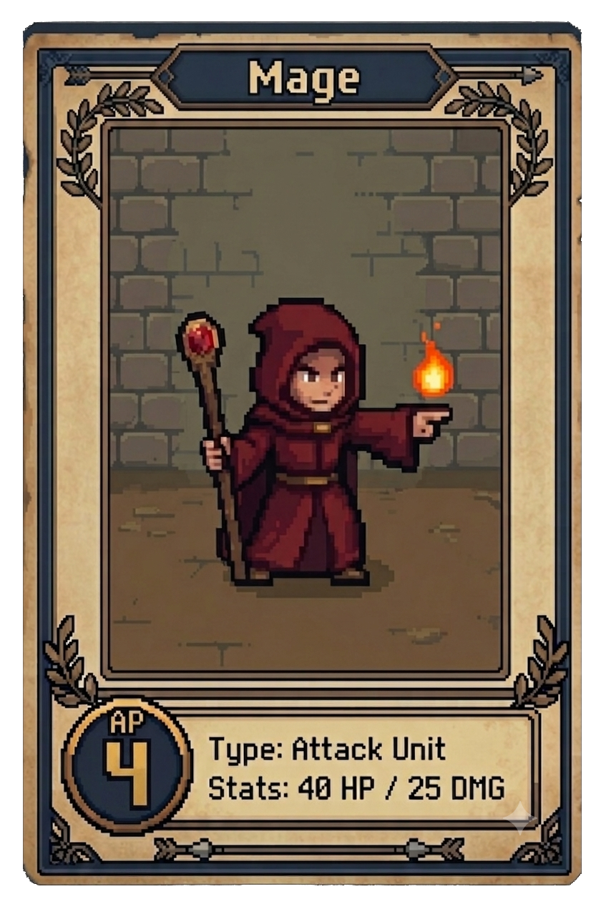 | 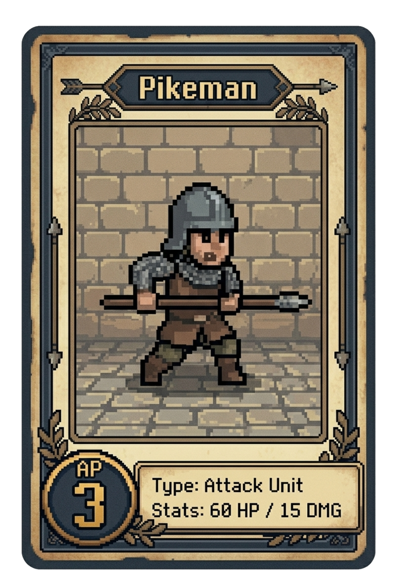 |
| **Knight** | **Archer** | **Mage** | **Pikeman** |
| 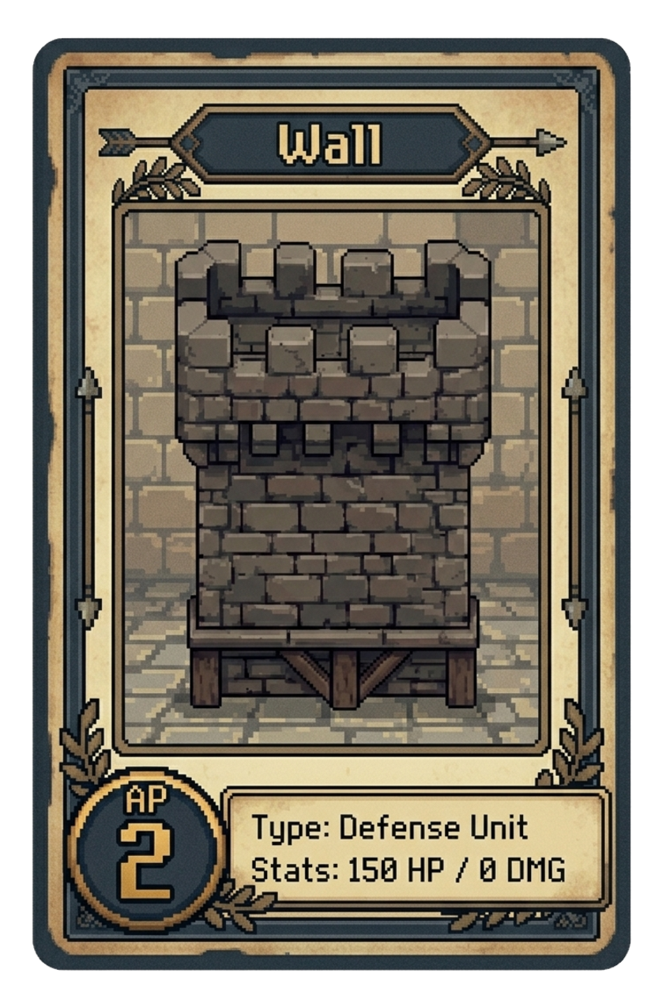 | 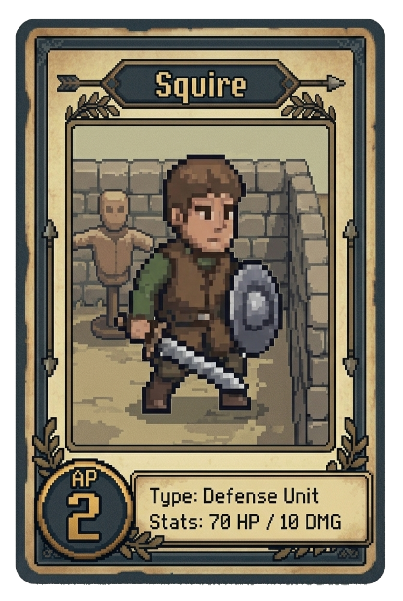 | 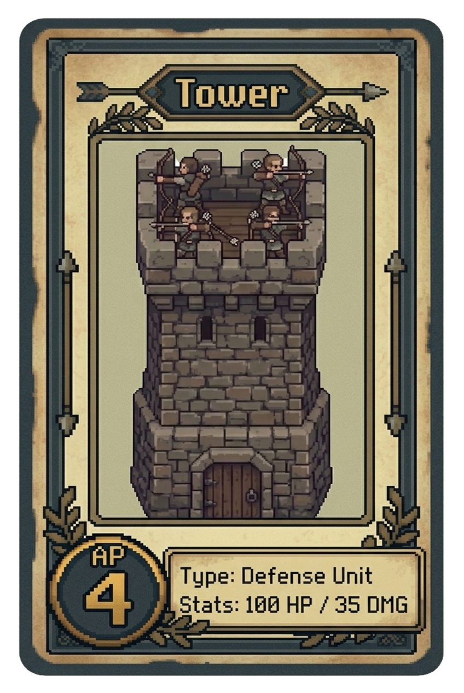 | 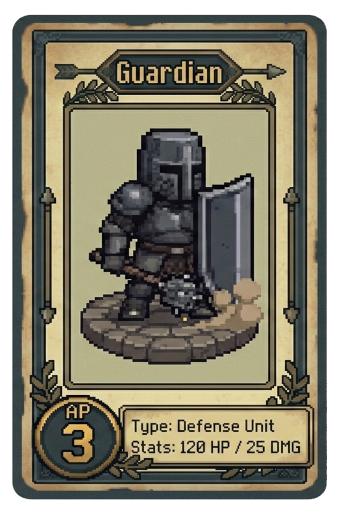 |
| **Wall** | **Squire** | **Tower** | **Guardian** |
|  | 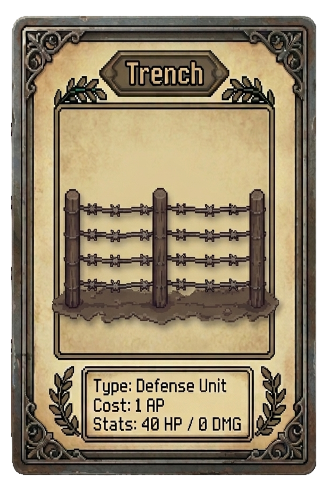 | 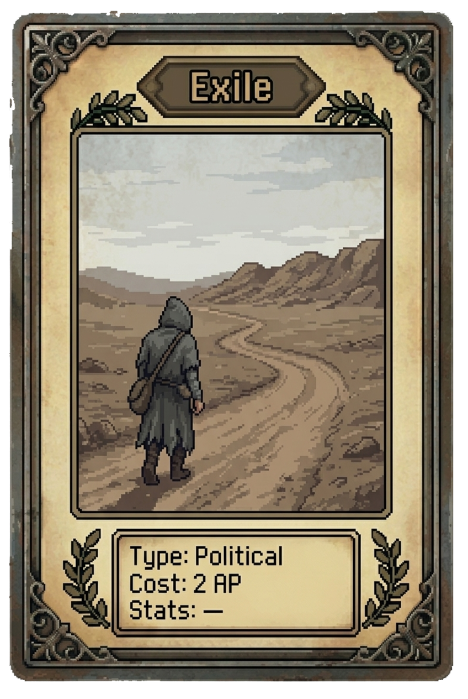 | 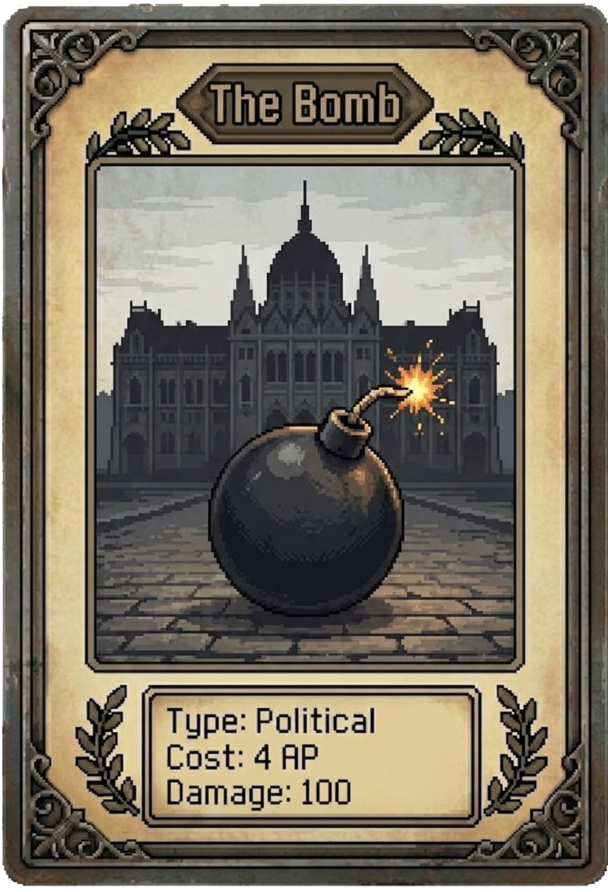 |
| **Royal Guard** | **Trench** | **Exile** | **Bomb** |
|  |  | 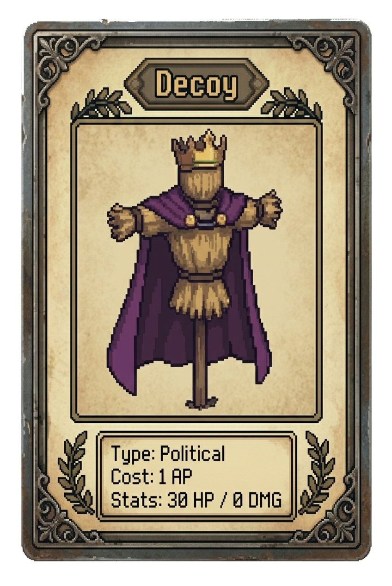 | |
| **Peace Treaty** | **Royal Curse** | **Decoy** | |

> **Implementation note about “Royal Decree”:** This card from the original GDD, which pushed enemies 1 tile per turn from a 3×3 zone, was discarded during development. Its push role was partially absorbed by the need to manage King movement through the Desperation system and by the Bomb card.

---

### Card Upgrades with Gold

Only ally-type cards, excluding Decoy, can be upgraded. Upgrades are cumulative from the base level.

| Upgrade Level | Gold Cost | Bonus | Example: Knight |
| :---- | :---- | :---- | :---- |
| **Base (Level 0)** | — | — | 80 HP / 30 DMG / 2 AP |
| **Level 1** | 20 gold | +15 HP / +10 DMG | 95 HP / 40 DMG / 2 AP |
| **Level 2** | 40 gold | +25 HP / +20 DMG / −1 AP | 105 HP / 50 DMG / 1 AP |
| **Level 3** | 50 gold | +40 HP / +35 DMG / −1 AP | 120 HP / 65 DMG / 1 AP |

Upgrades must be progressive. The player cannot jump directly from Level 1 to Level 3.

---

### Enemy Stats by Level

`[CHANGE]` **Skeleton King HP adjusted:** The original GDD listed 200 HP for the Skeleton King. In the final implementation, the Skeleton King has **500 HP** to make the encounter more challenging and consistent with the rest of the bosses.

| Level | Enemy | HP | Damage | Speed | Notes |
| :---- | :---- | :---- | :---- | :---- | :---- |
| **Level 1** | Skeleton | 50 | 15 | 1 tile/turn | Basic. Easy to intercept. |
| **Level 2** | Ogre | 80 | 25 | 1 tile/turn | More resistant. Requires stronger units. |
| **Level 3** | Elite Warrior | 100 | 35 | 2 tiles/turn | Fast. Evades slow defenses. |
| **`[CHANGE]` Boss 1** | Skeleton King | **500** | 30 | Special | Summons every 2 turns. Advances every 3 turns. Occupies 2×2. |
| **Boss 2** | Ogre Boss | 350 | 40 | Special | Same as Boss 1 but with higher stats. |
| **Boss 3** | Brave King | 500 | 50 | Special | Final challenge. Summons Elite Warriors. |

`[CHANGE]` **Boss summons:**

| Boss | Summoned Unit | Summoned HP | Summoned DMG |
| :---- | :---- | :---- | :---- |
| Skeleton King | Skeleton Vanguard | 80 | 22 |
| Ogre Boss | Ogre Brute | 100 | 30 |
| Brave King | Royal Elite | 120 | 40 |

### Boss Mechanics

`[CHANGE]` **The boss mechanic was modified from the original GDD.** The GDD stated that the boss “does not move while its summon is alive, and advances 1 tile when it dies.” In the final implementation, bosses follow a turn-based pattern, not one based on the death of their summons:

- At the start of combat, the boss occupies a 2×2 area at the top of the board.
- **Summoning:** The boss summons an additional enemy every 2 turns.
- **Movement:** The boss advances 1 tile toward the King every 3 turns.
- The cycle continues until the boss is defeated or its 2×2 body creates enough pressure inside the safe zone to trigger defeat. Direct contact alone is not a separate loss condition.
- Bosses count as 2 pressure inside the safe zone.
- Boss encounters have no turn limit: the player must defeat the boss to win.
- Boss encounters do not generate obstacles in order to provide enough space for the 2×2 boss.

---

## 2.3 Mindset

*(This section remains the same as in the original GDD.)*

### 1. Constant Tactical Tension

Every turn will present complex challenges and force the player to make difficult decisions: should they save AP for more powerful plays or deploy a unit now? Should they maintain the King’s position or risk moving?

### 2. Satisfaction of the Perfect Plan

When the player places a strategic wall, uses Peace Treaty to freeze three enemies in a single play, or combines cards intelligently, they create an extraordinary experience by watching their strategy unfold on the board.

### 3. Strategic Cowardice (Not Humiliating)

The King runs away and never attacks, but this is not weakness: it is cunning. The player acts as the brain behind the operation, implementing strategies to keep the King alive. The King’s animation with comedic expressions reinforces this tone without making it embarrassing.

### 4. Learning Through Repetition

Every death teaches something. “I should have used Exile earlier.” “Next time I’ll place the Tower first.” The permanent upgrade system creates a sense of progress instead of frustration.

### 5. One More Run (Healthy Addiction)

Random hands and the Desperation system, which forces the King to move, ensure that every attempt feels different and promotes replayability.

---

## 2.4 Roguelite and TCG Elements

*(This section is updated to reflect the final implementation.)*

### Roguelite Elements

| Roguelite Feature | Implementation in The Coward King |
| :---- | :---- |
| **Permanent progression** | Card upgrades (+damage, +HP, −cost) purchased with gold survive death. |
| **`[CHANGE]` Checkpoint system** | Death restarts from Level 1 Horde 1. |
| **Randomized runs** | Random cards in each horde from a pool of 15. Different builds in every attempt. |
| **Short sessions** | Each horde has a variable turn limit. The full game lasts 1–3 hours. |
| **Meaningful failure** | Defeat always teaches something. The game shows what caused the defeat. |
| **`[NEW]` Desperation System** | The King must move periodically. Not moving increases Desperation; reaching 4 loses the attempt. This forces active decision-making and prevents the player from staying still indefinitely. |

### TCG Elements

| TCG Feature | Implementation in The Coward King |
| :---- | :---- |
| **Hand management** | The player has 3–4 cards per horde and decides when to play each one. |
| **Pool and randomness** | 15 cards in the pool. They are dealt randomly, creating variable strategies. |
| **Resource cost system** | AP (1–4 per card) reflects the mana/energy system of TCGs. |
| **Retention choice** | Between hordes, the player keeps 1 card from the previous hand. |
| **Card upgrading** | Permanent upgrades (+damage, +HP, −cost) reflect upgrade systems in TCGs and CCGs. |
| **Synergy potential** | Combining cards (Exile + Mage, Wall + Tower, Peace Treaty + Guardian) creates powerful combos. |

---

## 2.5 Visual Style

*(This section reflects what was implemented; minor details are updated.)*

### Art Direction

The Coward King uses a pixel art aesthetic. The board has a dark style with alternating blue-gray tiles (#3f4652 / #252c35) and a golden border. The safe zone is highlighted with a semi-transparent golden tone.

| Art style | Pixel art, sprites of variable size by unit type |
| :---- | :---- |
| **Board style** | 8×8 grid with alternating blue-gray tones. Safe zone softly highlighted in gold. |
| **Color palette** | Muted medieval palette: stone grays, dark greens, parchment yellows, deep reds for enemies. |
| **`[NEW]` Desperation Panel** | Side panel with an image of the King that changes according to the Desperation level (0–4). It shifts from calm to total panic and pulses visually when Desperation is critical. |
| **Animations** | Sprites with 1–6 animation frames per unit (idle + attack). The wall has 3 frames based on remaining HP. |
| **Card UI** | Card buttons with artwork, stats (HP/DMG), AP cost, description, and upgrade level tag. |
| **Tone** | Comedic but readable. Humor comes from the King’s expressions and the card text, not from visual chaos. |

### Implemented Sprites

The following sprites are implemented and loaded in the game:

| Sprite | Animation |
| :---- | :---- |
| King | 3 cols × 2 rows (6 frames) |
| Skeleton | 3 cols × 1 row |
| Skeleton King (boss) | 1 frame |
| Knight | 2 cols × 2 rows |
| Archer | 3 cols × 2 rows |
| Wall | 3 cols × 1 row (visual damage) |
| Mage | 3 cols × 2 rows |
| Guardian | 3 cols × 2 rows |
| Ogre | 2 cols × 2 rows |
| Ogre Boss | 1 frame |
| Elite Warrior | 2 cols × 2 rows |
| Squire | 2 cols × 2 rows |
| Pikeman | 3 cols × 1 row |
| Royal Guard | 1 frame |
| Brave King (boss) | 1 frame |
| Tower | 1 frame |
| Decoy | 1 frame |
| Trench | 1 frame |

All units have an HP bar drawn underneath them, except for the King. The bar color changes from green → orange → red depending on remaining HP.

### Backgrounds by Level

Each level has its own background image:
- **Level 1 Catacombs:** `Assets/Level1.png`
- **Level 2 Ogre Dungeon:** `Assets/Level2.png`
- **Level 3 Brave King’s Castle:** `Assets/Level3.png`

| Level 1 — Catacombs | Level 2 — Ogre Dungeon | Level 3 — Brave King's Castle |
| :---: | :---: | :---: |
| 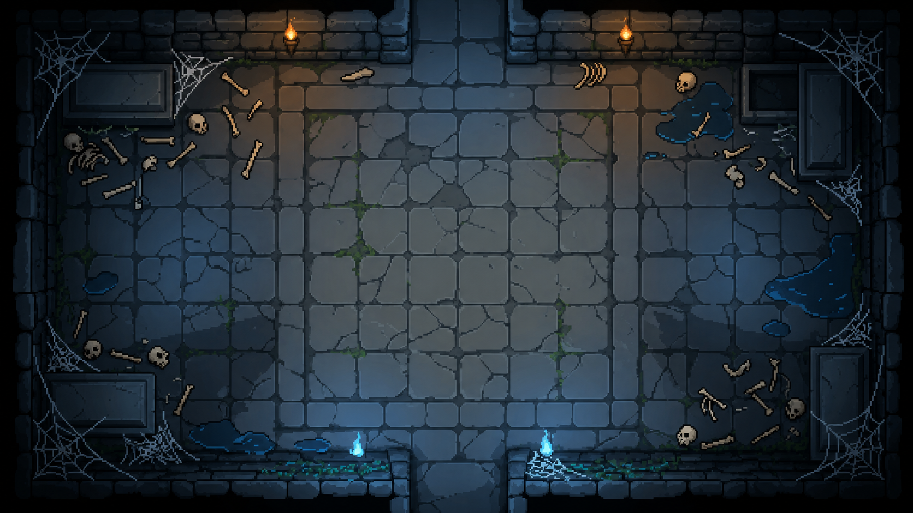 | 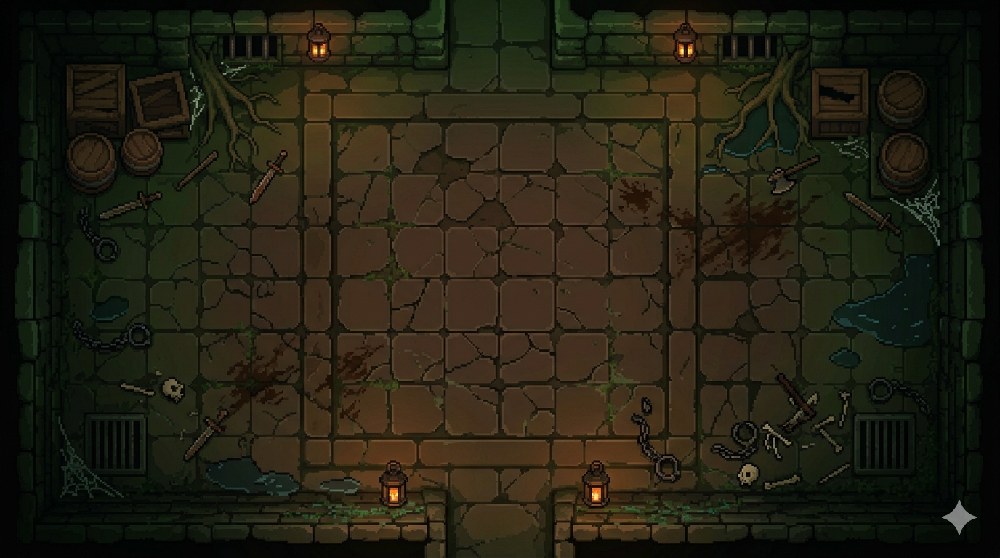 | 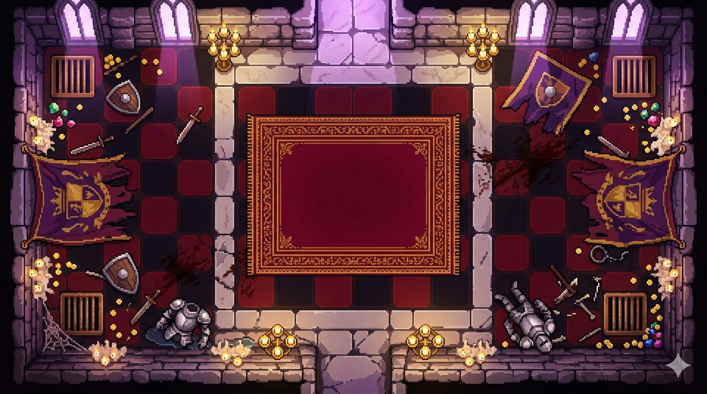 |

---

## 2.6 References

*(Unchanged from the original GDD.)*

- **Into the Breach:** Inspiration for board clarity and the focus on strategic positioning.
- **Slay the Spire:** Inspiration for card UI and roguelite progression.
- **Dungeon of the Endless:** Inspiration for wave defense with limited resources.

---

# 3. Technical

## 3.1 Screens

`[NEW]` **The screen system was expanded from the original GDD.** A complete main menu, authentication system, statistics screen with charts, and final victory screen were implemented.

### Main Menu (indexMenu.html)

First screen when opening the game. It contains:

1. **Login/User Button**
   - Allows the player to create an account or log in with username and password.
   - Stores the player identity, statistics, run records, and purchased upgrades through the API. Full board-state restoration is not implemented.
   - Guest mode available (without server persistence).
   - Option to register as Administrator (with access to the admin statistics panel).

2. **START GAME**
   - Starts a new game from Level 1.

3. **TUTORIAL**
   - Modal with an explanation of all rules, controls, cards, and an embedded tutorial video.

4. **STATISTICS**
   - Personal panel with player statistics (games played, enemies killed, gold earned, levels completed, attempt history).
   - Performance chart by attempt (Chart.js, bar chart).
   - Card upgrade chart (Chart.js, radar chart).
   - Purchased upgrades table.
   - **Admin Panel** (administrators only): global leaderboard, death distribution, horde completion rates, card upgrade popularity.

5. **CREDITS**
   - Project name, genre, team, and members.

6. **SETTINGS**
   - Volume sliders: Master, Music, Sound Effects.
   - Settings are saved in localStorage.

### Game Screen (index.html)

Main gameplay screen. Divided into:

- **Board Area:** 620×620px centered canvas. Shows the 8×8 board, the King, allies, enemies, effects, obstacles, highlighted safe zone, and movement/placement highlights.
- **Hand Panel (handPanel):** Located at the bottom. Shows available cards with artwork, stats, and AP cost. In “keep-mode,” it allows the player to choose which card to keep.
- **HUD:** Located at the top. Shows Level, Encounter, Turn/Limit, Phase, AP, Gold, Enemies on board/maximum, and Status.
- **`[NEW]` Desperation Panel:** Side panel showing the Desperation level (0–4) with a King image and visual meter. It pulses and turns red when critical.
- **Event Log:** History of the last 8 game events.
- **Action Buttons:** Move King, End Turn, Upgrades, Menu (pause).

### Transition Screen (card choice)

Appears after winning a horde. The hand panel changes to “keep-mode,” and the player clicks the card they wish to keep. Once selected, the “Continue” button is enabled.

### Upgrade Screen (Overlay)

Accessible during the player’s turn. Shows all upgradeable cards with their current stats, next-level stats, and gold cost. Upgrades are applied immediately, including to copies of the card already in the current hand.

### Pause Menu (Overlay)

Accessible during gameplay through the menu button. Options:
- Resume
- Save game (localStorage)
- Return to main menu

### Game Over / Result Screen

Displayed after winning or losing a horde/boss. The “Continue” button (victory) or “Retry Level” button (defeat) appears in the HUD to proceed.

### `[NEW]` Final Victory Screen

Activated after completing Level 3, including the Brave King. Displays a special celebration overlay with an option to return to the menu.

---

## 3.2 Controls

`[CHANGE]` **The game can be controlled with both mouse and keyboard.** The original GDD specified mouse-only control.

| Action | Input |
| :---: | :---: |
| Select card from hand | Left click on the card |
| Place unit or trap on the board | Left click on a valid tile |
| Move King (click) | Click “Move King,” then click a valid adjacent tile |
| Move King (keyboard) | Arrow keys / WASD for 4 directions; Q/E/Z/C for diagonals |
| Cancel selection | Escape |
| End turn | Click “End Turn” or press Spacebar |
| Open upgrade menu | Click “Upgrades” |
| Open pause menu | Click the menu button or Escape (if the upgrade overlay is closed) |
| Navigate menus | Left click |

Tiles show visual feedback when hovered: blue for King movement, green for card placement.

---

## 3.3 Mechanics

### Turn Phase System

1. **Player Phase:** The player can play cards, move the King, open upgrades, or end the turn without taking an action. Cards are selected by clicking them and then clicking the target tile.
2. **Enemy Phase:** Zone effects are applied (Peace Treaty, Royal Curse), then combat is resolved (order depends on horde number), dead objects are removed, active effects are counted, defeat is checked, Desperation is updated, victory is checked, new enemies spawn, and AP is recovered.

### `[NEW]` Desperation System

New mechanic not described in the original GDD:

- If the King does NOT move during the player turn, Desperation increases by 1 (maximum 4).
- If the King DOES move, Desperation resets to 0.
- Upon reaching Desperation ≥ 3, a warning loop sound is activated.
- Upon reaching Desperation = 4, the game is lost with the message “Defeat: the King surrendered to desperation.”
- The side panel shows the King’s face changing from calm to terrified as Desperation increases.
- Purpose: Prevent the player from staying static indefinitely and force active King movement.

### AP System

- The player starts each horde with 5 AP.
- `[CHANGE]` **AP is limited to a maximum of 5 at all times** (not unlimited as stated in the GDD).
- If the King does not move, +1 AP is recovered at the end of the turn, up to the 5 AP limit.
- If the King moves, no AP is recovered that turn.
- Cards cost 1–4 AP.
- `[CHANGE]` **The +5 AP bonus for winning a horde described in the original GDD is not implemented.** AP recovery occurs exclusively at a rate of +1 per turn without King movement.

### Card Selection and Placement

- The player clicks a card in the hand to select it; valid tiles are highlighted in green.
- “Ally” cards create an allied unit on the chosen tile.
- “Trap” cards (Exile) create a trap effect on the chosen tile.
- “Zone” cards (Peace Treaty, Royal Curse) create a zone effect.
- `[NEW]` The “Bomb” zone card detonates immediately when placed, dealing 100 AOE damage without leaving a permanent effect when cards are loaded from SQL. The offline fallback still uses an older 40-damage value.
- Cards cannot be placed on occupied tiles or tiles with active effects.

### King Movement

- Clicking the King or “Move King” activates movement mode, highlighting valid tiles in blue.
- The King moves 1 tile in any direction, including diagonally.
- He cannot move onto tiles occupied by allies, enemies, or obstacles.
- `[NEW]` The Royal Guard automatically follows the King with each movement.
- Moving the King consumes the turn and resets Desperation.

### Hand Randomization

- First horde of Level 1: 3 random cards from the 15-card pool.
- Rest of hordes and bosses: 4 cards (1 kept + 3 new random cards, or 4 new cards if none is kept).

### Enemy Spawn System

- During each enemy phase turn in normal hordes, 1–2 new enemies are generated on the available edges.
- The exact number is limited by `maxEnemiesOnBoard` for the current horde.
- Enemies do not appear inside the safe zone or on occupied tiles.
- Boss encounters do not generate new enemies through regular spawning; only the boss can summon its minions.

### Card Upgrade System

- Accessible from the upgrade overlay during the player’s turn.
- Shows all upgradeable cards (type “ally” except Decoy) with current and next-level stats.
- When buying an upgrade, gold is deducted, the level in the `upgradeRegistry` increases and persists between deaths, and cards already in hand are updated immediately.
- Upgrades persist through deaths because the `upgradeRegistry` only resets when starting a completely new game.

### Save System

- **Pause-menu snapshot:** The “Save Stats” button writes a partial snapshot to `localStorage`, including level, horde, AP, gold, hand names, King position, Desperation, and upgrades.
- **Current limitation:** No loader reconstructs the complete board, allies, enemies, effects, obstacles, or active turn from that snapshot. Therefore, full Resume Game behavior is not implemented.
- **Database persistence:** Logged-in users can persist statistics, run progress events, and upgrades through the API, but this is not a complete gameplay checkpoint.

### Ally Movement (Revised)

`[CHANGE]` **The original GDD described allies that moved automatically, such as the Knight moving toward the nearest enemy and the Pikeman moving quickly. In the final implementation, all allies are stationary (speed = 0) and only attack the nearest enemy within their attack range.** The Royal Guard is the exception: it follows the King when he moves.

### Ally Combat System

- During each enemy phase, all living allies with damage > 0 automatically attack the nearest enemy within their range.
- The Squire reduces damage received by adjacent allies by 50%.
- The King cannot attack (damage = 0, range = 0).
- If an enemy is adjacent to an ally, the enemy attacks the ally instead of advancing.
- “Cursed” enemies, under Royal Curse, deal 50% less damage.

---

# 4. Level Design

## 4.1 Themes

*(This section is updated with information from the final code.)*

### Level 1: Skeleton King, Catacombs

**Environment:** Gloomy atmosphere. Cold stone walls, flickering torches, and ruined arches frame the board. Color palette: stone grays, cold blues, muted torchlight yellows.

**Interactives:**
- Skeletons (50 HP / 15 DMG / 1 tile/turn). 3 progressive hordes.
- Skeleton King (Boss 500 HP / 30 DMG). Occupies 2×2. Summons a Skeleton Vanguard every 2 turns. Advances 1 tile toward the King every 3 turns.
- Skeleton Vanguard (summoned): 80 HP / 22 DMG.

**Horde configuration:**

| Horde | Max turns | Enemies/turn | Max on board | Obstacles |
| :---- | :---- | :---- | :---- | :---- |
| 1 | 10 | 1 | 8 | 0 |
| 2 | 15 | 1 | 10 | 2 |
| 3 | 20 | 2 | 12 | 4 |
| Boss | no limit | (summoned by boss) | — | 0 |

**Challenges:** Introduction to the core gameplay loop: AP management, card placement, and safe zone defense. Enemy stats are low, giving the player room to experiment.

---

### Level 2: Ogre Boss, Ogre Dungeon

**Environment:** Dark and oppressive dungeon with touches of a twisted forest. Deeper shadows, mossy stone, and deep reds. Palette: dark greens, dark browns, muted reds, murky shadows.

**Interactives:**
- Ogres (80 HP / 25 DMG / 1 tile/turn). Require stronger units or card combos.
- Ogre Boss (350 HP / 40 DMG). Occupies 2×2. Summons Ogre Brutes every 2 turns. Advances every 3 turns.
- Ogre Brute (summoned): 100 HP / 30 DMG.

**Horde configuration:**

| Horde | Max turns | Enemies/turn | Max on board | Obstacles |
| :---- | :---- | :---- | :---- | :---- |
| 1 | 20 | 1 | 7 | 2 |
| 2 | 26 | 1 | 9 | 4 |
| 3 | 32 | 2 | 10 | 6 |
| Boss | no limit | (summoned by boss) | — | 0 |

**Challenges:** Higher enemy HP requires better AP management. Players must rely on synergies (Wall + Tower, Guardian + Archer). The boss requires sustained damage through multiple summoning cycles.

---

### Level 3: Brave King, Brave King’s Castle

**Environment:** The final level takes place in the throne room of the enemy kingdom. Rich ornaments, tall windows, and golden candlelight create a striking visual background. Palette: deep reds, golden accents, royal purples, and dramatic lighting.

**Interactives:**
- Elite Warriors (100 HP / 35 DMG / 2 tiles/turn). Double movement bypasses many defensive formations.
- Brave King (Boss 500 HP / 50 DMG). Occupies 2×2. Summons Royal Elites every 2 turns. Advances every 3 turns.
- Royal Elite (summoned): 120 HP / 40 DMG / 2 tiles/turn.

**Horde configuration:**

| Horde | Max turns | Enemies/turn | Max on board | Obstacles |
| :---- | :---- | :---- | :---- | :---- |
| 1 | 20 | 1 | 8 | 2 |
| 2 | 28 | 2 | 10 | 3 |
| 3 | 34 | 2 | 12 | 4 |
| Boss | no limit | (summoned by boss) | — | 0 |

**Challenges:** The double movement of Elite Warriors breaks defensive formations from previous levels. Political cards (Exile, Peace Treaty) become critical. The boss’s summoned allies are severe threats themselves and must be eliminated quickly.

---

## 4.2 Game Flow

```
Main Menu
  └── START GAME
         │
         ▼
Level 1 - Horde 1  ──(victory: choose card to keep)──►  Horde 2  ──►  Horde 3  ──►  Boss: Skeleton King
                                                                                                  │
         ┌────────────────────────────────────────────────────────────────────────────────────────┘
         ▼
Level 2 - Horde 1  ──►  Horde 2  ──►  Horde 3  ──►  Boss: Ogre Boss
         │
         ▼
Level 3 - Horde 1  ──►  Horde 2  ──►  Horde 3  ──►  Boss: Brave King
                                                            │
                                                            ▼
                                                    FINAL VICTORY SCREEN
```

**Transition rules:**
- Between each horde: card selection screen to keep one card → new hand of 4 cards.
- The upgrade shop is available at any time during the player’s turn.
- On death: return to Level 1 Horde 1. Upgrades are kept; gold is lost.
- No starting level selection; progression is always sequential.

---

# 5. Development

## 5.1 Abstract Classes (Components)

*(This section reflects the classes actually implemented.)*

### GameObject (Base Class — Base of all game objects)

Represented internally in the game engine. All board objects extend `BoardObject extends GameObject`.

Attributes:
- `position` → Position in pixels on the canvas.
- `type` → Type identifier (king, enemy, ally, trap, zone, obstacle).
- `isActive` → Active/inactive state.

Methods:
- `update()` → Updates the object’s state.
- `render()` → Draws the object on screen.

### BoardObject (Derived class from GameObject)

Adds board tile coordinates.

Attributes:
- `row`, `col` → Position on the 8×8 grid.

Methods:
- `setTile(row, col)` → Moves the object to a new tile.

### Unit (Abstract Class — extends BoardObject)

Represents any entity that can move or take damage.

Attributes:
- `hp`, `maxHp` → Health points.
- `damage` → Attack value.
- `range` → Attack range in tiles.
- `speed` → Tiles per turn.
- `stunTurns` → Remaining paralysis turns.
- `slowedThisTurn` → Marker for whether it was frozen this turn.
- `cursedThisTurn` → Marker for whether it is under Royal Curse this turn.

Methods:
- `takeDamage(amount)` → Reduces HP.

### Board (Component)

Manages the 8×8 grid system.

Attributes:
- Separate lists: `allies[]`, `enemies[]`, `effects[]`, `obstacles[]`.
- `safeZone` → Dynamic 3×3 area around the King.

Methods:
- `isInSafeZone(row, col)`, `isInsideBoard(row, col)`, `getBlockingObject(row, col)`.
- `spawnEnemies()`, `spawnBoss()`, `generateObstacles()`.
- `checkDefeat()` → Checks whether pressure inside the safe zone is ≥ 2.

### TurnManager (Component)

Controls game flow.

Attributes:
- `phase` → “player” or “enemy”.
- `turn` → Current turn.
- `desperation` → King’s Desperation level (0–4).
- `status` → “playing,” “won,” or “lost.”

Methods:
- `resolveTurn()` → Executes all end-of-turn logic.
- `endPlayerTurn()` → Switches to enemy phase.
- `updateDesperation()` → Updates the Desperation meter.

---

## 5.2 Derived Classes

### King (extends Unit)

Special unit controlled by the player.
- HP = 0, Damage = 0, Range = 0, Speed = 1.
- Cannot attack.
- Moves 1 tile in any direction, like the king in chess.
- His position determines the 3×3 safe zone.

### Enemy (extends Unit)

Regular enemy that spawns every turn and tries to reach the King.
- Has `safeZoneWeight` (normally 1; 2 for bosses).
- Has `tileSpan` (normally 1; 2 for bosses).

### Boss (extends Enemy)

Level boss. Occupies 2×2 tiles.
- `tileSpan = 2`.
- `summonEveryTurns` (summons a minion every N turns).
- `moveEveryTurns` (advances 1 tile every M turns).

### Ally (extends Unit)

Allied unit placed by the player from a card.
- `cardName` → Name of the source card.
- `speed = 0` (all allies are stationary except Royal Guard, which follows the King).
- Automatically attacks the nearest enemy within range.

### Obstacle (extends BoardObject)

Immovable obstacle on the board.
- Blocks movement and card placement.
- Cannot be destroyed.
- Randomly generated at the start of each horde, not in boss fights.

### BoardEffect (extends BoardObject)

Temporary effect placed by a card (trap or zone).
- `effectType` → “trap” (Exile) or “zone” (Peace Treaty, Royal Curse).
- `duration` → Remaining active turns.
- `radius` → Effect radius (0 for trap, 1 for zone = 3×3).

### HandSystem (Component)

Manages the player’s cards.

Attributes:
- `hand[]` → Current hand (max. 4 cards).
- `keptCardName` → Card chosen to keep between hordes.
- `upgradeRegistry{}` → Dictionary {card_name: upgrade_level} that persists between deaths.

Methods:
- `drawCards(amount)` → Selects random cards from the pool while applying upgrades.
- `playCard(row, col)` → Places the selected card on the board.
- `chooseCardToKeep(card)` → Marks the card to keep.
- `applyUpgradeToCard(card)` → Applies upgrades to the card’s base stats.

### EnemySpawner (Component)

Controls enemy generation.

Behavior:
- Generates 1–2 enemies per turn according to the current horde configuration.
- Random placement on available edges.
- Respects the maximum enemy limit on the board.

### UpgradeSystem (Component)

Manages meta-progression.

Attributes:
- `gold` → Player’s current gold.
- `upgradeRegistry{}` → Persists between deaths.

Methods:
- `purchaseUpgrade(cardName)` → Deducts gold and increases the level in the registry.
- `renderUpgradeOverlay()` → Builds the upgrade UI.

---

# 6. Graphics

## 6.1 Style Attributes

*(Unchanged from the original GDD.)*

- Pixel art, sprites sized to fit the board.
- Muted medieval palette.
- Comedic and readable tone.

## 6.2 Implemented Graphics

### Characters and cards on the board

- King (animated sprite, 6 frames)
- Skeleton, Skeleton King (2×2 boss)
- Ogre, Ogre Boss (2×2 boss)
- Elite Warrior, Brave King (2×2 boss)
- Knight, Archer, Mage, Pikeman
- Wall (sprite with progressive visual damage)
- Squire, Tower, Guardian, Royal Guard
- Decoy, Trench
- Obstacle (immovable debris)

### Interface

- Cards in hand with their own artwork by upgrade level (base, lvl1, lvl2, lvl3)
- Desperation Panel with 5 images (`Cara0.png` to `Cara4.png`)
- Upgrade, pause, and victory overlays
- HUD with level, turn, AP, gold, and enemy information

### Backgrounds

- `Assets/Level1.png`, `Level2.png`, `Level3.png`

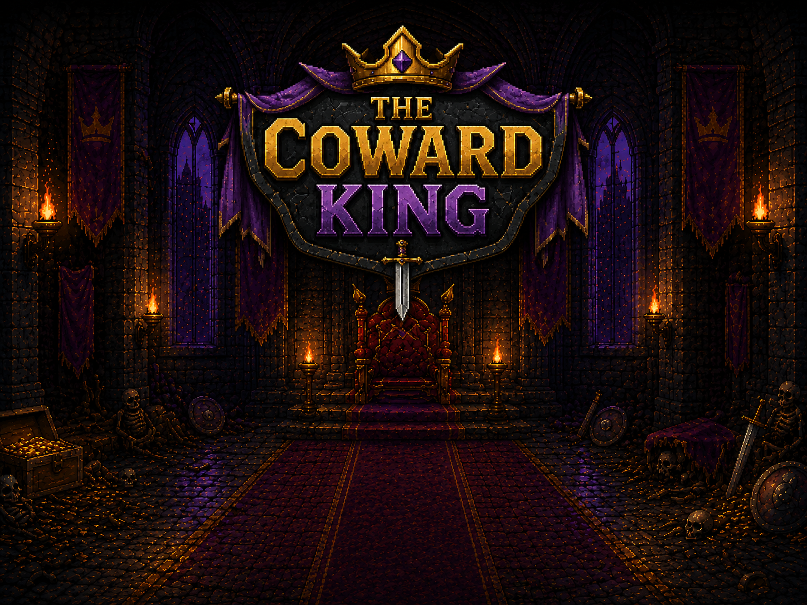

---

# 7. Sounds / Music

## 7.1 Style Attributes

*(Unchanged from the original GDD.)*

Medieval-themed ambient music that changes by level. Sound effects for each played card and combat event.

## 7.2 Implemented Sound Effects

| Event | File |
| :---- | :---- |
| Button click | sfx/button-click.mp3 |
| King movement | sfx/button-click.mp3 |
| Victory | sfx/victory.mp3 |
| Defeat | sfx/defeat.m4a |
| Critical Desperation loop | sfx/desperation-critical.mp3 |
| Death by Desperation | sfx/desperation-death.mp3 |

Sound effects by card: knight, archer, mage, pikeman, wall, squire, tower, guardian, royal-guard, trench, exile, bomb, peace-treaty, royal-curse, decoy.

## 7.3 Implemented Music

| Level | Track |
| :---- | :---- |
| Level 1 — Catacombs | audio/level1-skeletons.mp3 |
| Level 2 — Ogre Dungeon | audio/level2-ogres.mp3 |
| Level 3 — Royal Castle | audio/level3-royal.mp3 |

Music changes automatically when entering a new level. The main menu plays a random track from the three available options. Volume can be adjusted separately for master, music, and SFX, and is saved in localStorage.

---

# 8. Backend and Database

`[NEW]` **This section did not exist in the original GDD.** The game implements a complete backend with a relational database for player persistence, statistics, and upgrades.

### Technical Stack

- **Server:** Node.js + Express.js
- **Database:** MySQL (`coward_king` database)
- **Port:** localhost:3000
- **Authentication:** SHA-256 password hash

### Implemented API Endpoints

| Method | Route | Function |
| :---- | :---- | :---- |
| GET | /api/cards | Load the complete card pool |
| GET | /api/enemies/:levelId | Load enemies for a level |
| POST | /api/player | Register new player |
| GET | /api/player/:username | Login / search player |
| GET | /api/player/:id/dashboard | Personal statistics |
| GET | /api/player/:id/upgrades | Player upgrades |
| POST | /api/upgrade | Save card upgrade |
| POST | /api/run/start | Start new attempt |
| POST | /api/run/:id/complete-horde | Mark horde completed |
| POST | /api/run/:id/death | Register death |
| PATCH | /api/run/:id/level | Advance level |
| POST | /api/stats | Save encounter statistics |
| GET | /api/admin/leaderboard | Global leaderboard |
| GET | /api/admin/death-distribution | Death distribution |
| GET | /api/admin/horde-difficulty | Horde difficulty |
| GET | /api/admin/most-upgraded-cards | Most upgraded cards |
| GET | /api/admin/death-rates | Death rates by level |

### Guest Mode

The core game remains playable without an active server. If card loading fails, the local `cardPool` supplies 8 fallback cards. Authentication, database statistics, database-backed upgrades, and full 15-card SQL data require the backend and MySQL. Local volume settings and the partial pause snapshot use `localStorage`; fallback upgrades otherwise remain in runtime memory.

### Global Statistics (Admin Panel)

Available only to users with `is_admin = true`:
- Global leaderboard ranked by completed levels.
- Death distribution by level and horde.
- Horde completion rates (%).
- Card upgrade popularity (doughnut chart).
- Charts implemented with Chart.js.

---

# 9. Development Schedule

## Completed Development Phases

### 1. Base Systems
- 2D canvas engine with tile system.
- `tileToPosition` / `positionToTile` coordinate system.
- Base class `GameObject → BoardObject → Unit`.
- Tile-based collision system.

### 2. Gameplay Mechanics
- Phase system (Player/Enemy).
- AP system with turn-based recovery.
- Desperation system (new mechanic).
- Defeat detection through pressure in the safe zone.

### 3. Card System
- Pool of 15 cards with unique effects.
- “Keep mode” logic between hordes.
- Upgrade system with persistent `upgradeRegistry`.
- Placement limits by upgrade level.

### 4. Enemy System
- Dynamic spawning from multiple edges.
- Movement toward the King with simple pathfinding.
- Decoy prioritization as target.
- Stun (Exile), slow (Peace Treaty), and curse (Royal Curse) system.

### 5. Boss System
- 2×2 bosses with timer-based summoning and movement cycles.
- 3 bosses with their own summons: Skeleton King, Ogre Boss, Brave King.

### 6. UI Systems
- HUD with real-time information.
- Animated Desperation Panel with reactive images.
- Upgrade overlay with stat preview.
- Pause menu with partial local snapshot and statistics save; full restore remains pending.
- Final victory screen.

### 7. Roguelite System
- Progression through 3 levels × 4 encounters.
- Reset to Level 1 Horde 1 on defeat.
- Permanent upgrades between attempts.

### 8. Backend and Database
- Express.js server with MySQL.
- Authentication system with hashing.
- Statistics API (personal and global).
- Administrator panel with Chart.js charts.

### 9. Visual and Audio
- Animated sprites by unit type.
- 3 level backgrounds.
- 3 music tracks by level.
- 15 sound effects by card.
- Sound effects for global events (victory, defeat, Desperation).

### 10. Main Menu
- Animated menu with CSS castle decoration.
- Complete tutorial with embedded video.
- Personal statistics with charts.
- Login/registration system.
- Administrator panel.
- Persistent volume settings.

---

*Document prepared by Silent Crown — The Coward King — Final Updated Version*
